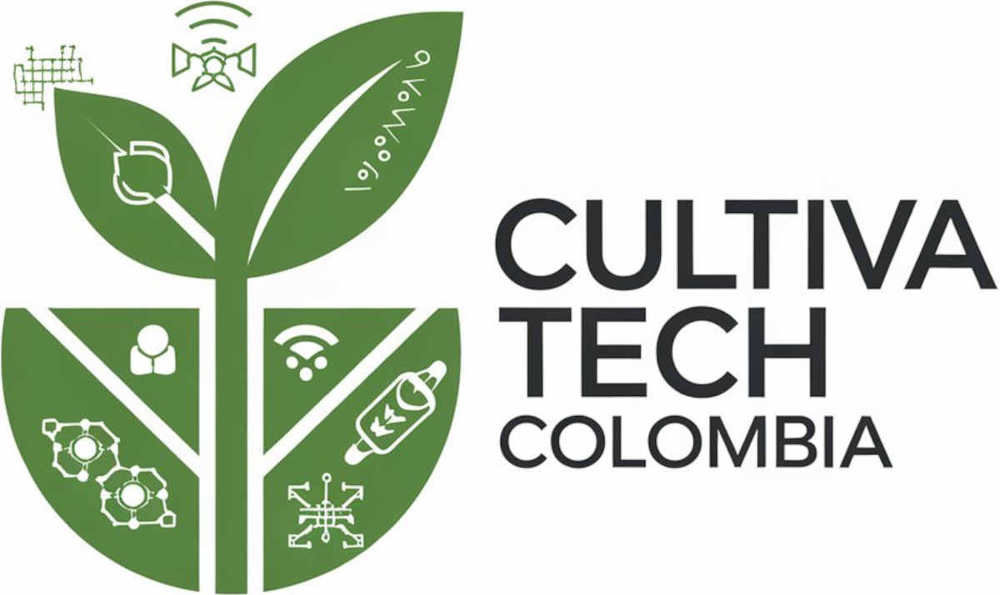

  

<h1 align="center">🌱🤖 CultivaTech ColombIA 🐝🇨🇴</h1>

<i>Innovación Agro-IoT con Arte, Ciencia y Tecnología by <strong>_-IR-_</strong> Productions</i>

   <a href="#español">Español</a> • 
   <a href="#english">English</a> • 
   <a href="#français">Français</a>

---

## 📍 Español

### 👤 Presentación de Lukas Moyano y _ _-IR-_ 
**Lukas Moyano** es un artista visual, pedagogo y tecnólogo colombiano con formación en Artes Visuales (M.A.V. - Pontificia Universidad Javeriana), Pedagogía (Uniminuto) y Tecnologías de la Información (UNAL/MinTIC). Fundador de **_-IR-_ Productions**, una iniciativa que fusiona **Arte + Ciencia + Tecnología** para impulsar la transformación sostenible en sectores clave como la agricultura, la educación y la cultura.

### 🌾 ¿Qué es CultivaTech ColombIA?

**CultivaTech ColombIA** es un sistema de monitoreo **Agro-IoT** diseñado para cultivos agrofrutales, micológicos y apícolas. Combina sensores inteligentes (ESP32, Raspberry Pi, ARM), inteligencia artificial para detección de anomalías y una plataforma web/móvil propia para visualizar datos y alertas en tiempo real. Su objetivo principal es **empoderar a los productores colombianos** con herramientas accesibles y precisas para optimizar sus procesos agrícolas.

### ❗ El Problema que Resolvemos

La falta de herramientas precisas y accesibles para el monitoreo en tiempo real en el agro colombiano conduce a ineficiencias, pérdidas económicas y desafíos en la sostenibilidad de los cultivos. Muchos productores carecen de información oportuna sobre las condiciones de sus cultivos, lo que dificulta la toma de decisiones informadas.

### 🎨🔬💻 Nuestra Solución y Enfoque (Arte+Ciencia+Tecnología)

- **Arte**: Interfaces intuitivas y visuales que facilitan la comprensión de datos complejos.
- **Ciencia**: Recolección y análisis de datos precisos mediante sensores y algoritmos de IA.
- **Tecnología**: Uso de hardware de código abierto (ESP32, Raspberry Pi), desarrollo con React y NodeJS, y conectividad mediante LoRaWAN, WiFi y 4G.

### 🛠️ Tecnologías Clave

- **Frontend**: React
- **Backend**: NodeJS
- **IA**: Python (Visión por Computador)
- **Hardware**: ESP32, Raspberry Pi, ARM
- **Conectividad**: LoRaWAN, WiFi, 4G
- **Bases de Datos**: PostgreSQL, TimeSeries

### 🚀 Estado Actual del Proyecto (MVP) y Próximos Pasos

Actualmente, contamos con un **MVP funcional** desarrollado en React y NodeJS, con capacidades de:

- Visualización de datos de sensores simulados y reales.
- Prototipo de detección de anomalías mediante IA.

**Próximos pasos**:

- Pruebas de campo extendidas.
- Integración de más sensores e IA avanzada.
- Desarrollo de una aplicación móvil nativa.
- Búsqueda de alianzas estratégicas y financiación.

### 🤝 ¡Únete a la (R)Evolución Agro-Tech!

**Cómo Colaborar**:

Buscamos colaboradores en las siguientes áreas:

- **Desarrolladores**: Frontend (React), Backend (NodeJS/Python), Firmware (C++), IA/ML.
- **Diseñadores**: UX/UI.
- **Testers**: Pruebas de usabilidad y funcionalidad.
- **Expertos**: Agronomía, apicultura, micología.

**Oportunidades de Inversión/Alianza**:

Estamos en busca de **inversión y alianzas estratégicas** para:

- Escalar la producción de hardware.
- Robustecer la plataforma de software.
- Expandir el impacto del proyecto.

Necesitamos **infraestructura tecnológica, física y humana** para llevar CultivaTech ColombIA al siguiente nivel.

### 📬 Contacto

- **Email**: [lukasmoyano@ir-productions.com](mailto:lukasmoyanomorales@gmail.com)
- **LinkedIn**: [linkedin.com/in/lukasmoyano](https://www.linkedin.com/in/lukasmoyano)
- **GitHub**: [github.com/IR-Productions](https://github.com/IR-Productions)

---

## 🇬🇧 English

### 👤 About Lukas Moyano & _ _-IR-_ _ Productions

**Lukas Moyano** is a Colombian visual artist, educator, and technologist with a Master's in Visual Arts (Pontificia Universidad Javeriana), a degree in Pedagogy (Uniminuto), and training in Information Technologies (UNAL/MinTIC). He is the founder of **__-IR-__ Productions**, an initiative that merges **Art + Science + Technology** to drive sustainable transformation in key sectors such as agriculture, education, and culture.

### 🌾 What is CultivaTech ColombIA?

**CultivaTech ColombIA** is an **Agro-IoT** monitoring system designed for agro-fruit, mycological, and beekeeping crops. It combines smart sensors (ESP32, Raspberry Pi, ARM), artificial intelligence for anomaly detection, and a proprietary web/mobile platform to visualize data and alerts in real-time. Its main goal is to **empower Colombian producers** with accessible and precise tools to optimize their agricultural processes.

### ❗ The Problem We're Solving

The lack of precise and accessible tools for real-time monitoring in Colombian agriculture leads to inefficiencies, economic losses, and challenges in crop sustainability. Many producers lack timely information about their crops' conditions, making informed decision-making difficult.

### 🎨🔬💻 Our Solution & Approach (Art+Science+Technology)

- **Art**: Intuitive and visual interfaces that facilitate the understanding of complex data.
- **Science**: Collection and analysis of precise data through sensors and AI algorithms.
- **Technology**: Use of open-source hardware (ESP32, Raspberry Pi), development with React and NodeJS, and connectivity via LoRaWAN, WiFi, and 4G.

### 🛠️ Key Technologies

- **Frontend**: React
- **Backend**: NodeJS
- **AI**: Python (Computer Vision)
- **Hardware**: ESP32, Raspberry Pi, ARM
- **Connectivity**: LoRaWAN, WiFi, 4G
- **Databases**: PostgreSQL, TimeSeries

### 🚀 Current Project Status (MVP) & Next Steps

We currently have a **functional MVP** developed in React and NodeJS, with capabilities including:

- Visualization of simulated and real sensor data.
- Anomaly detection prototype using AI.

**Next steps**:

- Extended field testing.
- Integration of additional sensors and advanced AI.
- Development of a native mobile application.
- Seeking strategic partnerships and funding.

### 🤝 Join the Agro-Tech (R)Evolution!

**How to Collaborate**:

We are looking for collaborators in the following areas:

- **Developers**: Frontend (React), Backend (NodeJS/Python), Firmware (C++), AI/ML.
- **Designers**: UX/UI.
- **Testers**: Usability and functionality testing.
- **Experts**: Agronomy, beekeeping, mycology.

**Investment/Partnership Opportunities**:

We are seeking **investment and strategic partnerships** to:

- Scale hardware production.
- Strengthen the software platform.
- Expand the project's impact.

We require **technological, physical, and human infrastructure** to take CultivaTech ColombIA to the next level.

### 📬 Get in Touch

- **Email**: [lukasmoyano@ir-productions.com](mailto:lukasmoyanomorales@gmail.com)
- **LinkedIn**: [linkedin.com/in/lukasmoyano](https://www.linkedin.com/in/lukasmoyano)
- **GitHub**: [github.com/IR-Productions](https://github.com/IR-Productions)

---
---

## 🇫🇷 Français

### 👤 Présentation de Lukas Moyano et ___-IR-___ Productions

**Lukas Moyano** est un artiste visuel, pédagogue et technologue colombien, titulaire d’un Master en Arts Visuels (Pontificia Universidad Javeriana), d’une licence en Pédagogie (Uniminuto) et formé aux Technologies de l’Information (UNAL/MinTIC). Fondateur de **__-IR-__ Productions**, une initiative qui fusionne **Art + Science + Technologie** pour promouvoir la transformation durable dans des secteurs clés comme l’agriculture, l’éducation et la culture.

### 🌾 Qu'est-ce que CultivaTech ColombIA ?

**CultivaTech ColombIA** est un système de surveillance **Agro-IoT** conçu pour les cultures agrofructicoles, mycologiques et apicoles. Il combine des capteurs intelligents (ESP32, Raspberry Pi, ARM), l’intelligence artificielle pour la détection d’anomalies, et une plateforme web/mobile dédiée pour visualiser en temps réel les données et alertes. Son objectif principal est de **renforcer les capacités des producteurs colombiens** grâce à des outils accessibles et précis permettant d’optimiser leurs processus agricoles.

### ❗ Le Problème que Nous Résolvons

L’absence d’outils de surveillance en temps réel, précis et accessibles, dans l’agriculture colombienne entraîne des inefficacités, des pertes économiques et des difficultés de durabilité pour les cultures. De nombreux producteurs n’ont pas accès à des informations fiables et actuelles sur leurs cultures, ce qui rend difficile la prise de décisions éclairées.

### 🎨🔬💻 Notre Solution : Art + Science + Technologie

- **Art** : Interfaces visuelles et intuitives facilitant la compréhension des données complexes.
- **Science** : Collecte et analyse de données précises via des capteurs et des algorithmes d’IA.
- **Technologie** : Utilisation de matériel open source (ESP32, Raspberry Pi), développement avec React et NodeJS, connectivité via LoRaWAN, WiFi et 4G.

### 🛠️ Technologies Clés

- **Frontend** : React  
- **Backend** : NodeJS  
- **IA** : Python (Vision par ordinateur)  
- **Matériel** : ESP32, Raspberry Pi, ARM  
- **Connectivité** : LoRaWAN, WiFi, 4G  
- **Bases de données** : PostgreSQL, TimeSeries

### 🚀 État Actuel du Projet (MVP) et Prochaines Étapes

Nous disposons actuellement d’un **MVP fonctionnel** développé en React et NodeJS, avec les fonctionnalités suivantes :

- Visualisation de données issues de capteurs réels et simulés.
- Prototype de détection d’anomalies basé sur l’IA.

**Prochaines étapes** :

- Tests de terrain élargis.
- Intégration de nouveaux capteurs et d’IA avancée.
- Développement d’une application mobile native.
- Recherche de partenariats stratégiques et de financements.

### 🤝 Rejoignez la (R)Évolution Agro-Tech !

**Comment collaborer** :

Nous cherchons des collaborateurs dans les domaines suivants :

- **Développeurs** : Frontend (React), Backend (NodeJS/Python), Firmware (C++), IA/ML.  
- **Designers** : UX/UI.  
- **Testeurs** : Tests d’utilisabilité et de fonctionnalité.  
- **Experts** : Agronomie, apiculture, mycologie.

**Opportunités d’investissement / de partenariat** :

Nous sommes à la recherche **d’investissements et de partenariats stratégiques** pour :

- Produire le matériel à grande échelle.
- Renforcer la plateforme logicielle.
- Étendre l’impact du projet.

Nous avons besoin **d’infrastructures technologiques, physiques et humaines** pour faire passer CultivaTech ColombIA à la vitesse supérieure.

### 📬 Contact

- **Email** : [lukasmoyano@ir-productions.com](mailto:lukasmoyanomorales@gmail.com)  
- **LinkedIn** : [linkedin.com/in/lukasmoyano](https://www.linkedin.com/in/lukasmoyano)  
- **GitHub** : [github.com/IR-Productions](https://github.com/IR-Productions)

---
